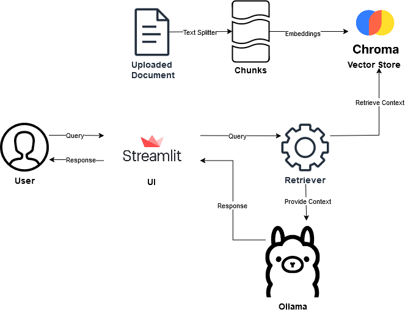
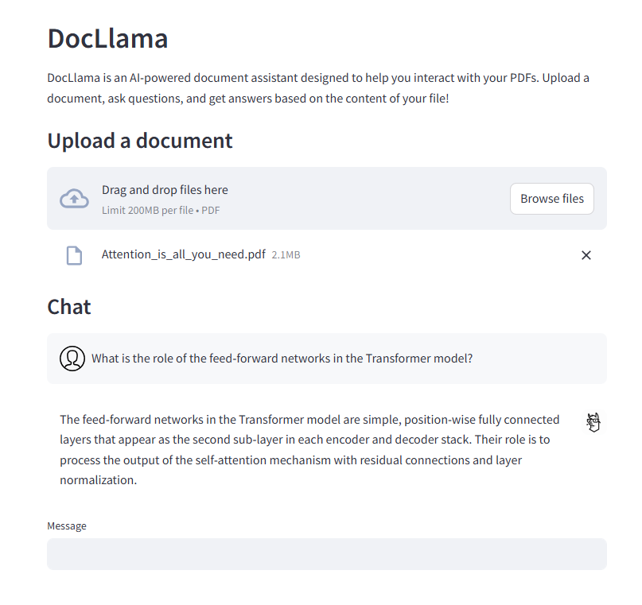

# DocLlama

DocLlama is an AI-powered document assistant designed to help you interact with your PDFs using the help of LLMs and RAG. This application was built using open source Python tools.

Currently it uses [mistral 7b](https://mistral.ai/news/announcing-mistral-7b/) but it is capable of using other LLMs available using Ollama.

Just upload a document, ask questions, and get answers based on the content of your file!

## Tech stack
<ul>
    <li>Python 3.10</li>
    <li>Ollama</li>
    <li>Streamlit</li>
    <li>Chroma</li>
</ul>

## How to run
<ol>
    <li>Clone the repository.</li>
    <li>Ensure that you have Python 3.8 or above installed. (I used Python 3.10)</li>
    <li>Install the requirements using <code>pip -r install requirements.txt</code></li>
    <li> Run the app with <code>streamlit run app.py </code></li>
    <li>The application should be running at <code>http://localhost:8501</code></li>
</ol>

## Flow Diagram

## Screenshots

